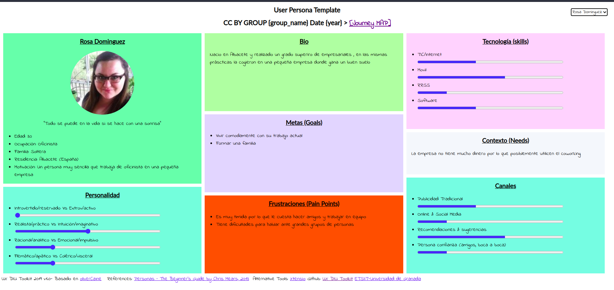
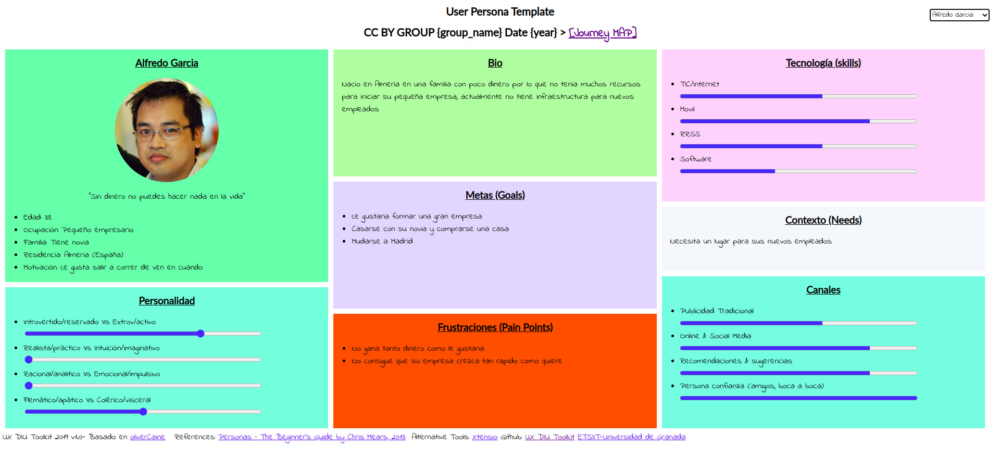
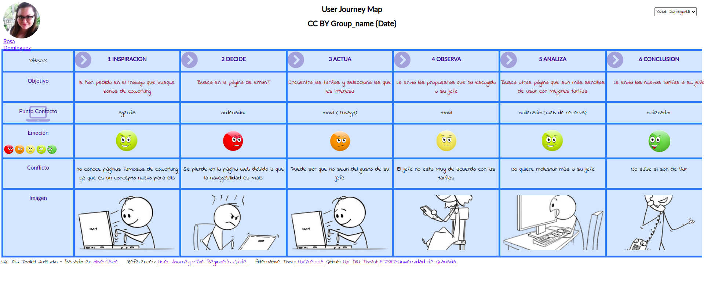
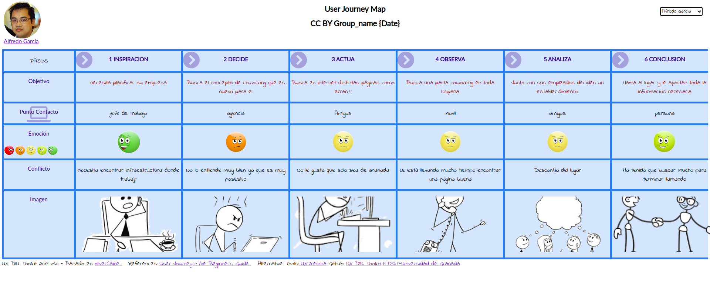
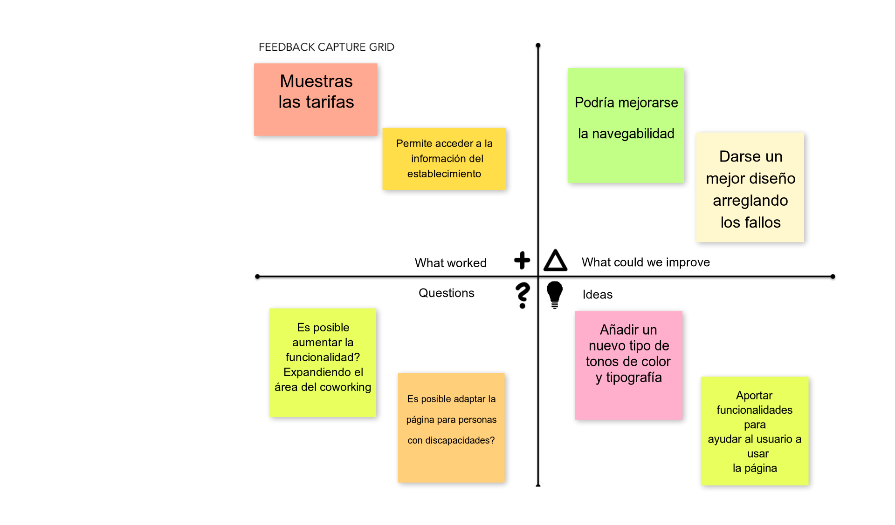
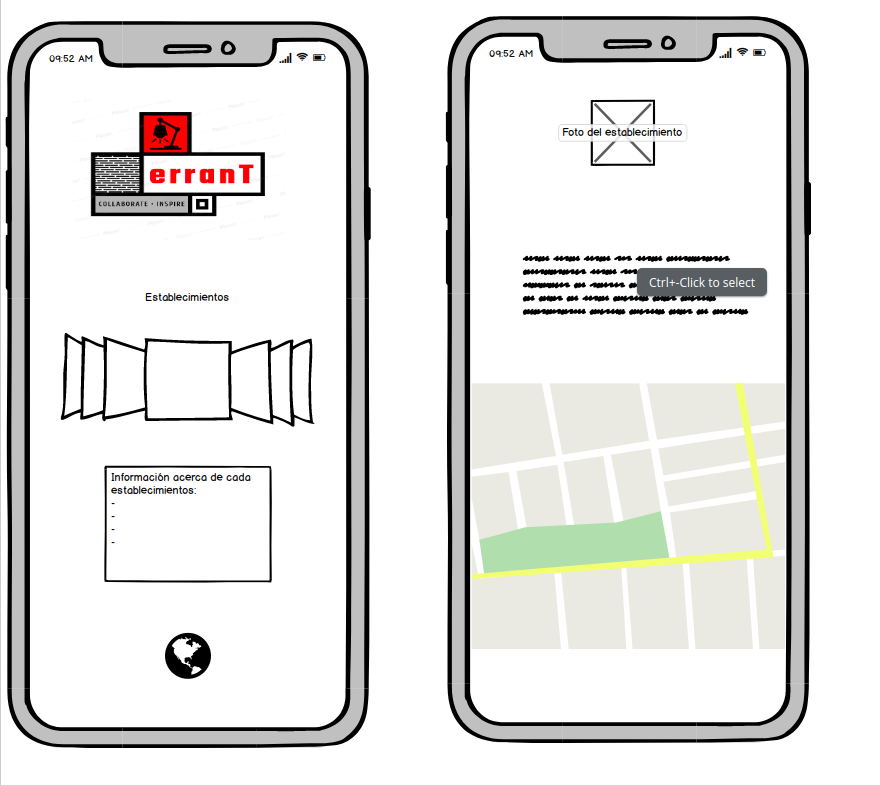
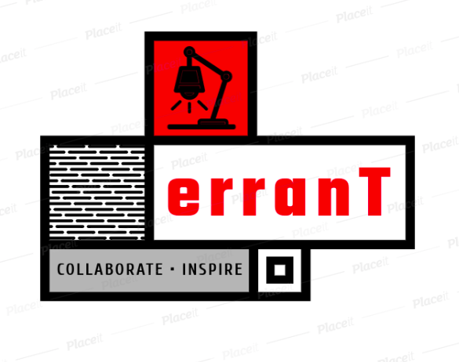

# DIU-TrabajoFinal

**Autor** : Rubén Delgado Pareja

**Descripción**: Dentro de este repositorio explicaré todos los pasos que voy a llevar a cabo para analizar y rediseñar 
la página web de una empresa de coworking

**Página web**: erranT

------

# 1.Análisis

La principal tarea a realizar a la hora de rediseñar una página web es el analisis de estar para percibir en que sitios 
se podría mejorar y cuales no habría que cambiar , de esta forma desde el principio ya tenemo claro que hacer.

## 1.1 Análisis Competitivo:
Para realizar este análisis comparativo voy a comparar la página de erranT con una página de coworking en España
[Coworkingspain](https://coworkingspain.es/) la cual tiene muy buena pinta y funcionalmente es muy correcta, teniendo la misma funcionalidad de buscar espacios para realizar el coworking. De esta manera podrémos observar rápidamente cuales son los aspectos que tenemos que tener en cuenta a la hora de realizar el rediseño de la página web y sobre que partes debemos centrarnos.

**-Navegabilidad**: Navegar por la página de erranT es complicado ya que inicialmente no te dice donde puede reservar ni te permite buscar que lugares hay, a diferencia de erranT Coworkingspain te permite buscar principalmente entre distintas ciudades e incluso antes de buscar ciudades muestra los espacios coworking más solicitados. Adems tiene una búsqueda asistida donde te ayudana a encontrar tu espacio coworking una vez te has registrado.

**-Funcionalidad**: Desde coworkingspain te indican precios de los distintos espacios disponibles desde que buscas el lugar, por otra parte en erranT tienes que buscar el apartado de las tarifas dentro de la página web. Desde mi punto de vista creo que deberían estar a simple vista

**-Diseño**: La página de erranT tiene fallos que se muestran en la portada y no queda muy  buen, aunque los temas de los colores son adecuados y correctos pero poco llamativos a diferencia de Coworkingspain donde se ve todo con mayor claridad y facilidad

## 1.2 Personas y User Journey Map:

Para observar la eficacia de la página web voy a crear a dos usuarios ficticios que usarán la página web de erranT: 

Como estamos haciendo usuarios para una página web de coworking ambas tendrán , de alguna manera, hacer uso de dicha página web

## 1.3 Puntos que evitar / Metas:

A la hora de rediseñar la página web tenemos que tener presente que debemos evitar- **Puntos a evitar**

-Dificultad de navegación.

-La página esté caida o tenga errores.

-Información erronea o desactualizada.

A la hora de rediseñar tenemos que saber que es lo que busca el usuario- **Metas**

-Locales adecuados para el trabajo.

-Localización en sitio no muy concurridos y con buen ambiente.

-Tarifas claras con información pertinente.

## 1.4 Usability Review:

Principalmente la página tiene el error que puede asustar al usuario cuando lo vea , al igual que también lo puede desconcertar, por otra parte no ayuda a la búsqueda de las tarifas aunque plantea correctamente los establecimientos. También aporta más información al final de la página y cuando se encuentran las tarifas permite ponerte en contacto con el establecimiento. Respecto al diseño es correcto pero podría mejorar los temas de los colores como el mapa y la tipología de la letra. No está adaptado para personas con discapacidades

Nota: 56 (Moderate)

[Usabilty Review](Usability-review-final.pdf)

# 2.Diseño UX

## 2.1 Feedback Capture Grid

### Propuestas de valor:
La principal propuesta que se va a llevar a cabo es el rediseño de lo necesario en la página para mejorar la accesibilidad del usuario y ayudarle en su seguimiento de la página , al igual que en un futuro se podría expandir la página web para que englobe más ciudades y reuna las zonas de coworking. Junto a esto también podría desarrollarse una aplicación para móvil

## 2.2 Wireframe

## Logotipo 

# Valoración Personal
Desde mi punto de vista he aportado ciertos cambios necesarios que podrían mejorar en varios aspectos la página de erranT. Al igual que he añadido un logotipo que creo que le pega más que el anterior, tiene el mismo tema de colores que la página ya que no he considerado modificarlo , aunque es cierto que podría mejorarse. Por otra parte me gustaría haber ayudado a que está página pueda ser usada por todo tipo de personas, inclusive las que tienen especial dificultad a la hora de navegar por Internet. En conclusión, como el tiempo era limitido he modificado las partes cruciales desde mi punto de vista.

